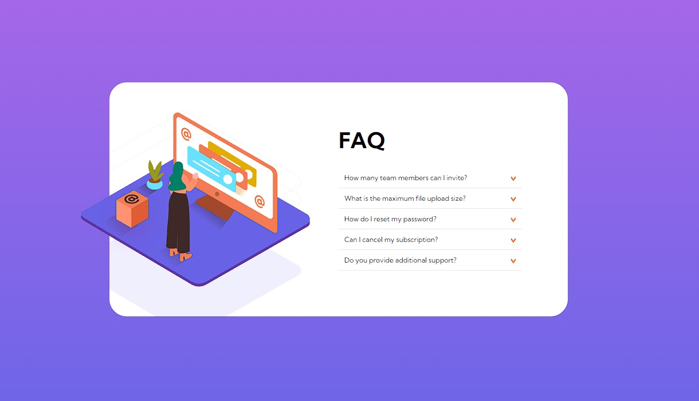

# Frontend Mentor - FAQ accordion card solution

This is a solution to the [FAQ accordion card challenge on Frontend Mentor](https://www.frontendmentor.io/challenges/faq-accordion-card-XlyjD0Oam). Frontend Mentor challenges help you improve your coding skills by building realistic projects. 

## Table of contents

- [Overview](#overview)
  - [The challenge](#the-challenge)
  - [Screenshot](#screenshot)
  - [Links](#links)
- [My process](#my-process)
  - [Built with](#built-with)
  - [What I learned](#what-i-learned)
  - [Continued development](#continued-development)
- [Author](#author)

**Note: Delete this note and update the table of contents based on what sections you keep.**

## Overview

### The challenge

Users should be able to:

- View the optimal layout for the component depending on their device's screen size
- See hover states for all interactive elements on the page
- Hide/Show the answer to a question when the question is clicked

### Screenshot

### Links

- Solution URL: (https://www.frontendmentor.io/solutions/responsive-faq-accordion-card-javascript-and-sass-yNzze7FmEW)
- Live Site URL: (https://roonderfaqcard.netlify.app/)

## My process

This was a really nice project to keep understanding the uses of absolute, fixed, and relative objects for CSS. I had a pretty hard time in the beggining when I needed to locate the illustrations, but after I did the mobile version, the rest of it was really easy to understand. Practice makes better.

Along with it, it's a really good project to keep practicing the events and Array Methods to add functionalities to the app.

### Built with

- Semantic HTML5 markup
- CSS custom properties
- Flexbox
- CSS Grid
- Mobile-first workflow
- [SASS] - CSS Preprocessor
- [Gulp] - Toolkit to automate workflow
- JavaScript ES6
- [Node.js] - JavaScript Enviroment for dependencies

### What I learned

I learned better on how to locate objects using the properties "absolute" and "relative", and to select inner elements from DIVs (for example) using array methods. Also, this exercise improved my thinking method on how to use the sizes and improve my responsive designs, using better breaking points for the two sizes asked.

### Continued development

Thanks to this project, I'll keep practicing how to include better responsive functionalities to my projects and make a better use of the position properties.

## Author

- GitHub - [Roonder](https://github.com/roonder)
- Frontend Mentor - [@roonder](https://www.frontendmentor.io/profile/roonder)
- Twitter - [@roonderdev](https://www.twitter.com/roonderdev)
